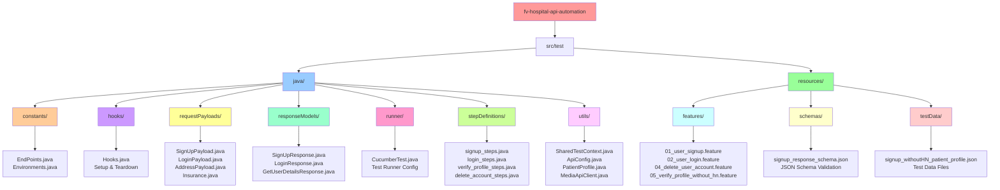

# FV Hospital API Automation Framework

[](https://www.oracle.com/java/)
[](https://maven.apache.org/)
[](https://cucumber.io/)
[](https://rest-assured.io/)
[](https://github.com/FasterXML/jackson)

## 📋 Project Overview

This is a **comprehensive API automation testing framework** for the **FV Hospital (FB@Home)** application, designed to validate the complete patient lifecycle from registration to profile verification. The framework demonstrates **enterprise-grade testing practices** using modern tools and architectural patterns that align with industry standards.

### 🎯 Project Achievements

✅ **Complete Patient Journey Automation** - End-to-end testing of patient registration, login, profile management, and account lifecycle  
✅ **Advanced BDD Implementation** - Human-readable test scenarios using Cucumber with Gherkin syntax  
✅ **Robust Test Data Management** - Dynamic test data generation with static JSON fallbacks  
✅ **JSON Schema Validation** - Contract testing ensuring API response structure compliance  
✅ **JWT Token Management** - Secure authentication handling across test scenarios  
✅ **Multi-Environment Support** - Configurable endpoints and environment-specific testing  
✅ **Comprehensive Reporting** - Multiple report formats with detailed execution analytics  
✅ **CI/CD Ready** - Maven-based execution suitable for pipeline integration

## 🏥 Application Under Test

The **FV Hospital (FB@Home)** application is a comprehensive healthcare platform that enables:
- Patient registration and authentication
- Profile management and verification
- Hospital Number (HN) assignment and verification
- Insurance and identity document management
- Complete patient lifecycle management

## 🔄 Test Workflow Architecture


## 🏗️ Framework Architecture

### 📁 Project Structure Diagram



### 🗂️ Directory Structure Overview

```
src/test/
├── java/
│   ├── constants/           # API endpoints and environment configurations
│   ├── hooks/               # Cucumber lifecycle hooks for setup/teardown
│   ├── requestPayloads/     # Request payload models (POJOs)
│   ├── responseModels/      # Response model classes for deserialization
│   ├── runner/              # Cucumber test runner configuration
│   ├── stepDefinitions/     # Step definition implementations
│   └── utils/               # Test utilities and shared context management
└── resources/
    ├── features/            # Gherkin feature files (BDD scenarios)
    ├── schemas/             # JSON schema files for response validation
    └── testData/            # Static test data files and media assets
```

## ✨ Key Features & Industry Standards Compliance

### 🎯 **BDD Implementation**
- **Gherkin Syntax**: Feature files written in business-readable language
- **Living Documentation**: Tests serve as executable specifications
- **Stakeholder Collaboration**: Bridge between business and technical teams

### 🏛️ **Enterprise Architecture Patterns**
- **Page Object Model Adaptation**: Applied to API testing with payload/response models
- **Dependency Injection**: Using Cucumber PicoContainer for clean object management
- **Separation of Concerns**: Clear separation between test logic, data, and configuration
- **Single Responsibility Principle**: Each class has a focused, single purpose

### 📊 **Test Data Management (Industry Best Practice)**
- **Hybrid Approach**: Combines static JSON files with dynamic data generation
- **Data Factory Pattern**: `TestDataFactory` using JavaFaker for realistic test data
- **Test Data Isolation**: Each test gets fresh, independent data
- **Environment-Specific Data**: Configurable data sources per environment
- **Data-Driven Testing**: JSON-based test data for maintainability

### 🔒 **Security & Token Management**
- **JWT Token Handling**: Secure token storage and management across test scenarios
- **Authentication Context**: Centralized token management with `AuthTokenContext`
- **Session Management**: Proper cleanup and token lifecycle management

### 🛡️ **Validation & Quality Assurance**
- **JSON Schema Validation**: Contract testing with schema validation
- **Response Model Mapping**: Type-safe response handling with POJOs
- **Assertion Strategies**: Multiple validation layers for comprehensive testing
- **Error Handling**: Robust error handling and meaningful failure messages

### 📈 **Reporting & Observability**
- **Multi-Format Reporting**: JSON, HTML, and console reports
- **Cucumber Reports**: Industry-standard BDD reporting
- **Traceability**: Clear mapping between requirements and test execution
- **CI/CD Integration**: Maven-based execution suitable for pipeline integration

## 🔄 API Test Coverage & Workflows

### 🏥 **Complete Patient Journey Testing**

#### 1. **Patient Registration** (`01_user_signup.feature`)
   - ✅ **Dynamic Test Data Generation**: Realistic patient data using SharedTestContext
   - ✅ **Comprehensive Field Validation**: All required patient information fields
   - ✅ **JSON Schema Validation**: Response structure compliance verification
   - ✅ **Token Management**: JWT token extraction and secure storage
   - ✅ **Profile Status Verification**: Initial profile status validation as "INCOMPLETE"

#### 2. **User Authentication** (`02_user_login.feature`)
   - ✅ **Credential Validation**: Country code, phone number, and password authentication
   - ✅ **JWT Token Validation**: Secure token generation and validation
   - ✅ **Session Management**: Authentication state establishment
   - ✅ **Response Validation**: Success status and token presence verification

#### 3. **Profile Verification Workflow** (`05_verify_profile_without_hn.feature`)
   - ✅ **Multi-Step Verification Process**: Address, Photo ID, and Insurance details
   - ✅ **Document Upload Integration**: Media API client for file uploads
   - ✅ **CMD System Integration**: Cross-system validation with hospital management
   - ✅ **Hospital Number (HN) Assignment**: Automated HN generation and verification
   - ✅ **Profile Status Lifecycle**: Complete verification workflow tracking
   - ✅ **Data Consistency Validation**: Patient-side vs CMD-side data matching

#### 4. **Account Lifecycle Management** (`04_delete_user_account.feature`)
   - ✅ **Secure Account Deletion**: Authenticated deletion workflow
   - ✅ **Data Cleanup Verification**: Complete account removal validation
   - ✅ **End-to-End Lifecycle**: Complete patient journey from creation to deletion

### 🔗 **Advanced Test Flow Management**
- **🔄 Sequential Execution**: Tests designed for ordered execution with dependencies
- **🗃️ Shared State Management**: `SharedTestContext` for cross-scenario data sharing
- **🧹 Automated Cleanup**: `@cleanUp` hooks for proper test environment teardown
- **🏷️ Tag-Based Execution**: `@requireUser` for dependency management
- **🔐 Token Lifecycle**: Secure JWT token management across test scenarios

## 📊 Reporting & Analytics

### 📈 **Multi-Tier Reporting Strategy**
After test execution, comprehensive reports are generated:

- **JSON Reports**: `target/jsonReports/cucumber.json` (Machine-readable)
- **HTML Reports**: `target/cucumber-html-report` (Human-readable)
- **Advanced Cucumber Reports**: `target/cucumber-html-reports` (Enterprise-grade)
- **Console Output**: Real-time execution feedback

### 📋 **Report Features**
- **Test Execution Summary**: Pass/fail statistics with timing
- **Step-by-Step Details**: Granular execution information
- **Screenshot Integration**: (Configurable for UI components)
- **Trend Analysis**: Historical test execution data
- **CI/CD Integration**: Jenkins/GitHub Actions compatible

## 🛠️ Technology Stack & Dependencies

### 🔧 **Core Technologies**
- **Java 17**: Modern LTS version with enhanced features and performance
- **Maven 3.8+**: Advanced dependency and build management with multi-module support
- **Cucumber 7.27.0**: Latest BDD framework with enhanced Gherkin support
- **REST Assured 5.5.5**: Industry-leading API testing library with advanced validation
- **JUnit 4.13.2**: Reliable test execution framework with comprehensive assertions

### 📚 **Supporting Libraries & Integrations**
- **Jackson 2.19.2**: High-performance JSON processing and object mapping
- **JSON Schema Validator 5.4.0**: Contract testing and response structure validation
- **Cucumber PicoContainer 7.27.0**: Lightweight dependency injection container
- **Maven Surefire Plugin 3.2.5**: Advanced test execution and reporting
- **Maven Cucumber Reporting 5.9.0**: Enterprise-grade HTML report generation

### 🏗️ **Architecture Patterns Implemented**
- **Page Object Model (API Adaptation)**: Structured payload and response models
- **Factory Pattern**: Dynamic test data generation with `SharedTestContext`
- **Singleton Pattern**: Centralized configuration management
- **Builder Pattern**: Fluent API request construction
- **Strategy Pattern**: Multiple validation approaches (schema, field-level, business logic)


## 🚀 Getting Started

### 📋 Prerequisites
- Java 17 or higher
- Maven 3.8+ 
- IDE (IntelliJ IDEA recommended)

### 🏃‍♂️ Running Tests

#### Run All Tests
```bash
mvn clean test
```

#### Run Specific Feature
```bash
mvn test -Dcucumber.options="src/test/resources/features/01_user_signup.feature"
```

#### Generate Reports
```bash
mvn clean test verify
```

### 📊 View Reports
After test execution, reports are available at:
- **HTML Report**: `target/cucumber-html-reports/overview-features.html`
- **JSON Report**: `target/jsonReports/cucumber.json`
- **Console Output**: Real-time execution feedback

## 🎯 Key Technical Achievements

🏆 **Enterprise-Grade Framework Design**  
🏆 **Complete Healthcare Domain Coverage**  
🏆 **Advanced BDD Implementation with Cucumber**  
🏆 **Robust Test Data Management Strategy**  
🏆 **Comprehensive API Contract Testing**  
🏆 **Secure Authentication & Session Management**  
🏆 **Multi-System Integration Testing (Patient + CMD)**  
🏆 **Production-Ready CI/CD Integration**  
🏆 **Industry-Standard Reporting & Analytics**  
🏆 **Scalable Architecture with Design Patterns**

## 📬 Contact

**Soumesh Bhaumik**  
📧 Email: [bhaumiksoumesh12@gmail.com](mailto:bhaumiksoumesh12@gmail.com)  
💼 LinkedIn: [https://www.linkedin.com/in/contact-soumesh-bhaumik-a0b3b3352/](https://www.linkedin.com/in/contact-soumesh-bhaumik-a0b3b3352/)

---

*This framework demonstrates advanced API testing capabilities suitable for enterprise healthcare applications, showcasing modern testing practices and comprehensive automation strategies.*